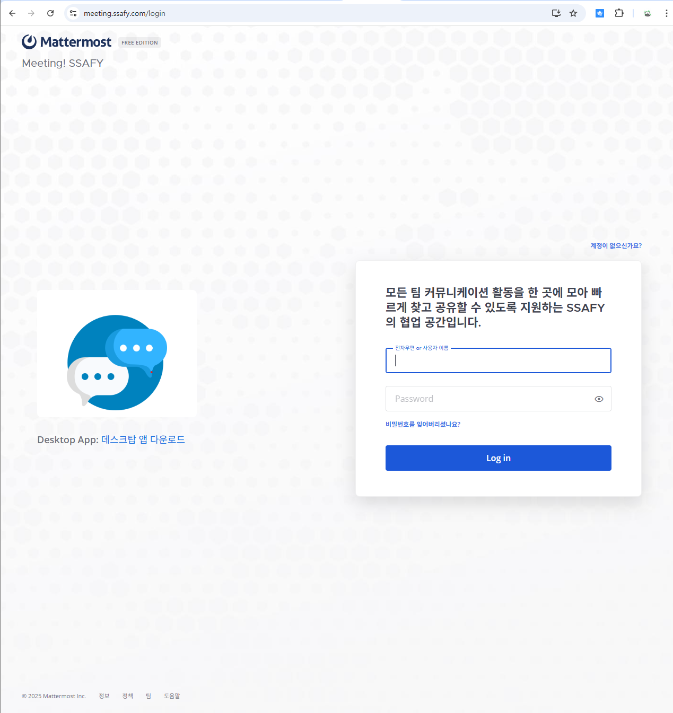
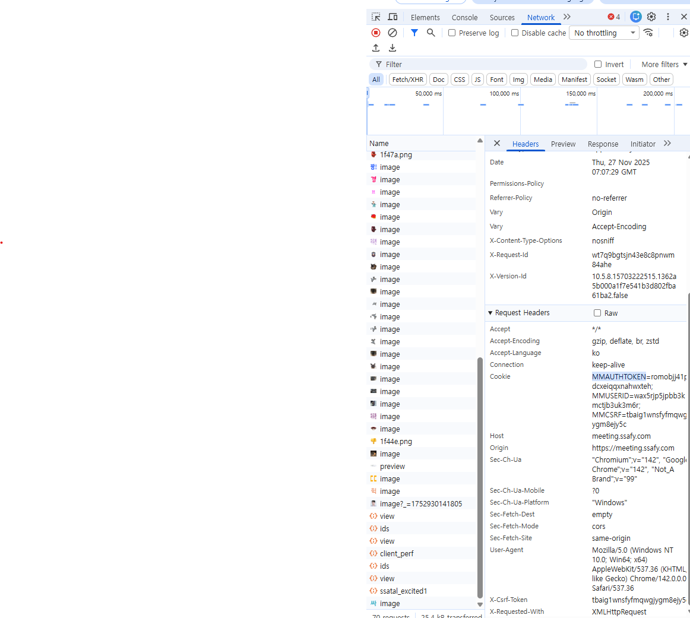
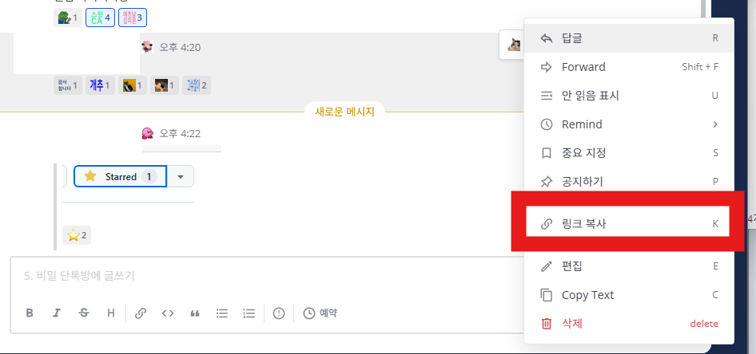
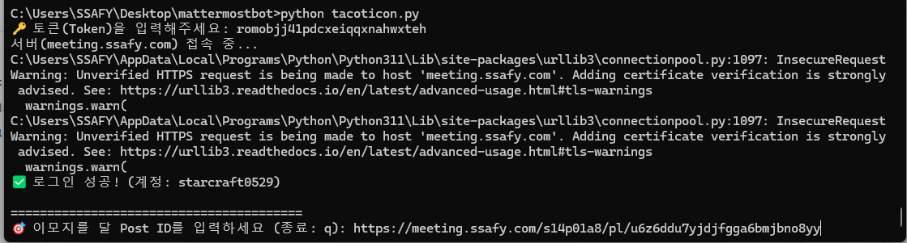

-----

# 🚀 Mattermost Auto Emoji Bot (매터모스트 이모지 자동 반응 봇)

Mattermost(매터모스트) 게시글 링크나 ID를 입력하면, 내 계정으로 **설정된 이모지들을 자동으로(그리고 무작위 순서로)** 달아주는 파이썬 스크립트입니다.

## ✨ 주요 기능

  * **링크 자동 파싱:** 게시글의 `Post ID`뿐만 아니라 `링크(URL)`를 통째로 넣어도 알아서 ID만 추출합니다.
  * **랜덤 셔플:** 매번 이모지 순서를 무작위로 섞어서 기계적인 느낌을 줄입니다.

## 🎞️ 시연영상
https://github.com/user-attachments/assets/620d6032-9937-4ef0-bb99-2ed933e0f54f


-----

## 🛠 설치 및 준비 (Prerequisites)

### 1\. Python 설치

Python 3.x 버전이 설치되어 있어야 합니다.

### 2\. 라이브러리 설치

터미널(CMD)에서 아래 명령어로 필수 라이브러리를 설치하세요.

```bash
pip install mattermostdriver
```

-----

## 🔑 중요: 토큰(Token) 추출하는 법

이 봇은 별도의 봇 계정을 생성하지 않고, **사용자의 브라우저 세션 정보(Token)**를 사용하여 작동합니다. 아래 순서대로 토큰을 확보해 주세요.

### 1\. 웹 브라우저로 접속

Mattermost PC 앱이 아닌, **Chrome(크롬)이나 Edge 브라우저**를 켜고 회사 Mattermost 주소로 접속하여 로그인합니다.
	

### 2\. 개발자 도구 실행

키보드의 **`F12`** 키를 눌러 개발자 도구를 엽니다. (화면 우측이나 하단에 창이 뜹니다.)

### 3\. 네트워크 탭 확인

1.  개발자 도구 상단의 **`Network`** 탭을 클릭합니다.
2.  이 상태에서 Mattermost 화면을 **새로고침(F5)** 하거나 다른 채널을 클릭합니다.

### 4\. 토큰 값 찾기 (MMAUTHTOKEN)

1.  Name 리스트에 뜨는 `me`, `channels`, `posts` 등 아무 항목이나 클릭합니다.
2.  오른쪽 **Headers** 탭을 선택합니다.
3.  스크롤을 내려 **Request Headers** 섹션을 찾습니다.
4.  **`Cookie`** 항목에 있는 **`MMAUTHTOKEN=xxxx...`** 값을 찾습니다.
5.  `xxxx...` 에 해당하는 긴 문자열이 바로 **토큰**입니다. 이를 복사해 두세요.



> **⚠️ 주의:** 이 토큰은 **로그아웃하면 즉시 만료**되며, 일정 시간이 지나면 바뀔 수 있습니다. 봇이 작동하지 않으면 위 과정을 통해 새 토큰을 확인하세요.

-----

## 💻 사용 방법 (Usage)

1.  터미널에서 스크립트를 실행합니다.

    ```bash
    python tacoticon.py
    ```

2.  안내에 따라 **토큰**을 입력합니다.

3.  이모지를 달고 싶은 게시글의 **링크(Copy Link)** 또는 **ID**를 입력합니다.
    
    

4.  봇이 자동으로 이모지를 답니다!

      * 종료하려면 `q`를 입력하세요.

-----

## 📝 커스터마이징

소스 코드 상단의 `EMOJI_LIST` 리스트를 수정하여 원하는 이모지를 추가하거나 뺄 수 있습니다.

```python
# 예시: 원하는 이모지 영문명을 추가하세요 (콜론 제외)
EMOJI_LIST = ['taco', 'fire', 'clap', 'sparkles', 'rocket', 'smile']
```

-----

## ⚠️ 보안 주의사항

  * 입력하는 토큰은 **본인 계정의 비밀번호와 동등한 권한**을 가집니다.
  * 절대로 토큰 값을 깃허브(GitHub) 등 공개된 곳에 올리지 마세요.
  * 공용 컴퓨터에서는 사용 후 반드시 로그아웃하여 토큰을 파기해야 합니다.
